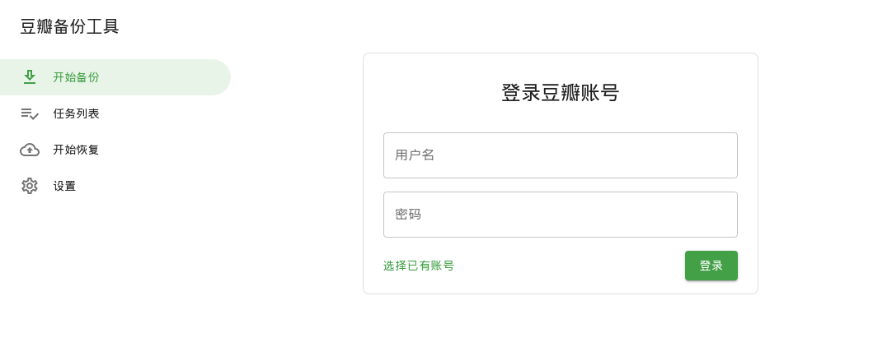
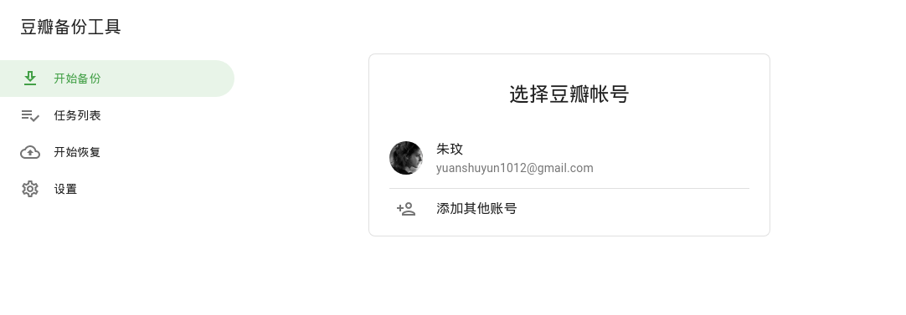
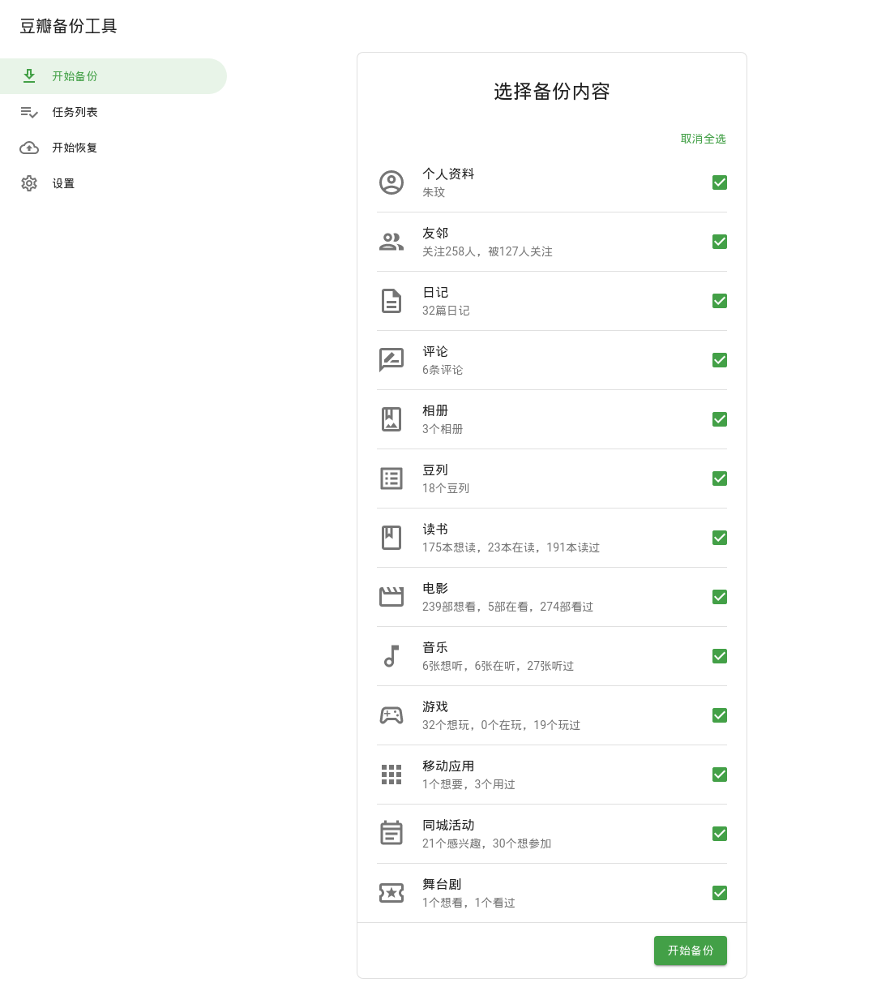

# Douban Backup Tool

A desktop application with web technologies and Electron that can backup and restore personal data for [Douban](https://www.douban.com) users with its JSON API, including marked movies/books/music, posts, followers/followees, etc. Implemented with React/Redux.

## Features

- Material Design
- Backup book/movie/music marks
- Customize request interval
- Recreate new accounts

## Preview

